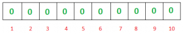
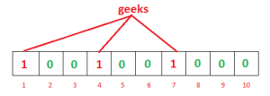

1. 什么是 Bloom Filter?

Bloom Filter 是一种基于哈希的概率数据结构。主要用来检测元素是否存在，与其他集合数据结构相比，它需要的空间非常少。

2. 应用场景

注册用户时检测用户是否已存在

3. 特点

- 自身长度固定， 但可以作为任意长度数据的集合
- 添加元素不会失败， 但是随着元素的增多， false positive 的概率也会上升， 直到所有比特位都变为 1， 那时所有的查询都会返回 false positive
- 不会出现 false negative 的情况， 即返回元素不存在，但是元素实际是存在的
- 元素一旦添加无法删除

4.  工作原理

空的 Bloom Filter 是一个 m 位的比特位数组, 所有位都为 0  

我们需要 k 个哈希函数来计算输入数据的哈希值. 当我们想添加元素的时候我们分别计算出 hash_1(input)...hash_k(input)， 并将哈希值对应的比特位置 1

假设我们有 3 个哈希函数， filter 的长度是 10

> h1(“geeks”) % 10 = 1  
> h2(“geeks”) % 10 = 4  
> h3(“geeks”) % 10 = 7

如果此时我们要检查"geeks"是不是存在于 filter 中， 我们按同样的方法计算哈希值并检查相应的比特位。如果所有的位都为 1， 那说明 geeks**可能**存在于 filter 中。如果有任何一位为 0，则说明不存在

为什么是可能存在而不是一定存在?
