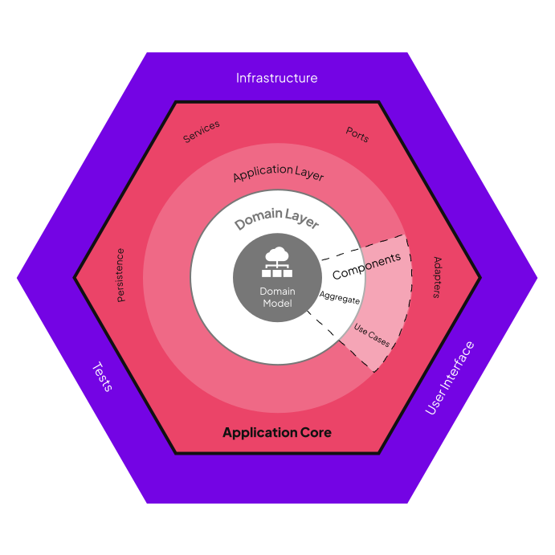

采用层级架构主要是为了做到隔离， 尽可能让我们在替换软件中某些部分时可以不影响到其他部分。而且分层可以使开发和维护者更容易理解软件是如何运行的

层级之间的通过接口(interface)来进行通信

表现层(视图层): 负责用户交互  
应用层(服务层): 将完整的业务功能暴露给表现层  
业务层(业务逻辑层): 实现系统的核心功能， 包含业务逻辑  
数据访问层(持久化层): 实现应用与数据库之间的通信  
每一层依赖下一层并向上层提供服务。

通常情况下一个请求会按顺序依次穿过表现层-> 应用层 -> 业务层 -> 数据访问层, 响应会按相反的方向返回到表现层。

分层的优势:  
比如我们要添加一个 gRPC 形式的用户接口， 我们只需要在表现层中添加一个新的实现，并且调用与 RESTful 相同的应用层服务即可

关键点:

- 向下依赖， 例如表现层依赖于服务层
- 数据访问层为核心， 因为最终依赖都指向数据访问层

六边形架构与层级架构相似， 但是它把业务层放到了架构的核心， 将本来处于最底层的数据访问层放到了外面的设施层。

从外向内分别是:

设施层: 对应层级架构的表现层和数据访问层
应用层
业务层

请求从外向内， 响应由内向外

业务层不依赖于任何其他层, 方便业务的定义

应用核心(业务层与应用层)需要与外围的设施层中的组件进行关联， 为此引入了端口和适配器的概念  
端口: 协议接口(interface)用来插接具体实现。他们本质上是应用核心的使用说明。
适配器: 端口协议的实现。实际作用是实现应用核心与外界的通讯

驱动适配器: 处于设施层中数据访问部分的适配器
被驱动适配器: 处于设施层中表现部分的适配器

层级架构与六边形架构最主要的区别在于依赖方向。在六边形架构中适配器可以直接依赖其他实现， 但是应用核心只依赖于抽象的端口。所以六边形架构的所有依赖都是指向中心的。
